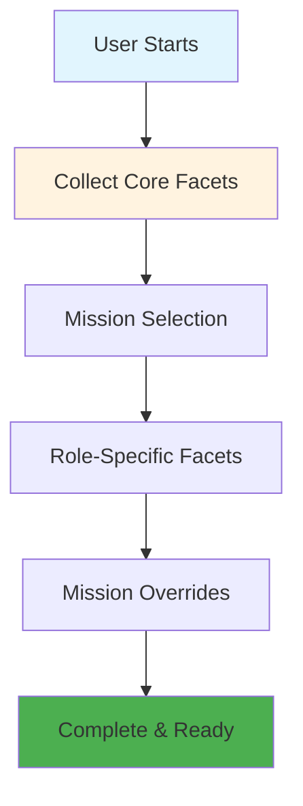
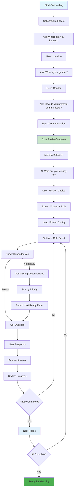
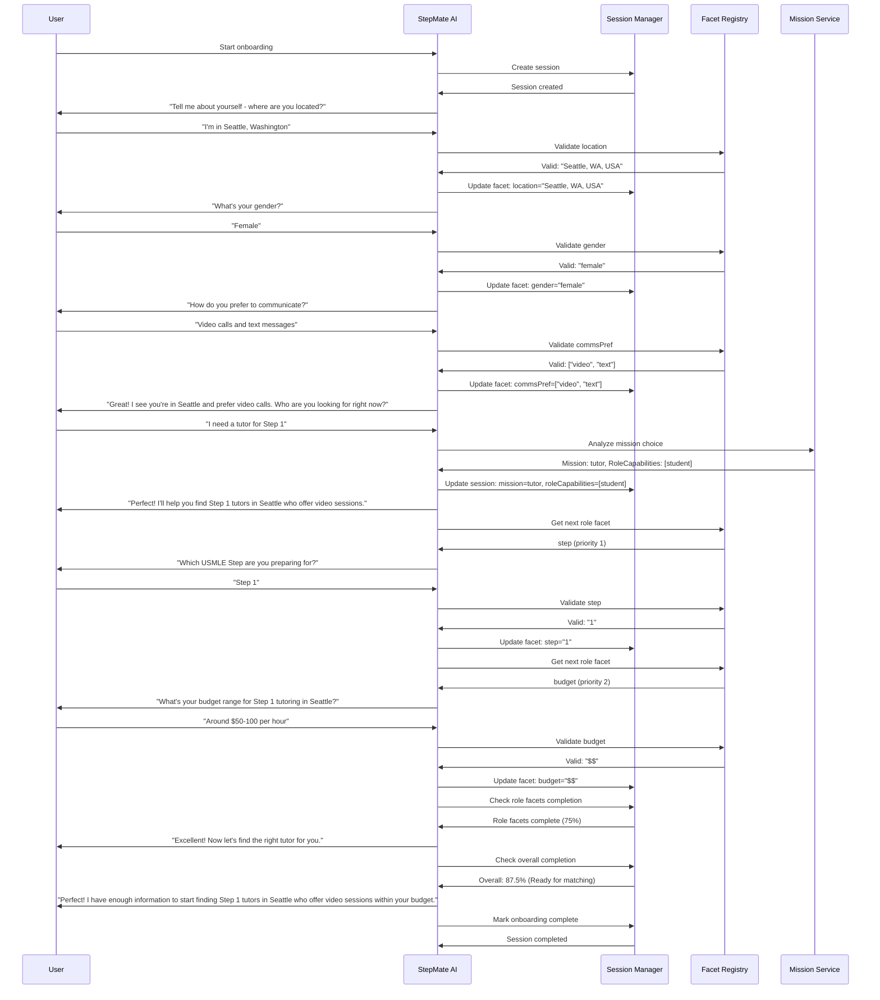

# StepMate Facet-Graph Onboarding Architecture
## Technical Implementation Guide

---

## 🏗️ Architecture Overview

**Goal**: Replace fixed 5-stage onboarding with dynamic, mission-driven facet collection  
**Approach**: Configuration-driven architecture using existing chat infrastructure  
**Key Change**: Dynamic prompt generation based on user's current phase and mission

---

## 📁 File Structure

### Option 1: Current Structure (Monolithic)
```
backend/CircleServer/functions/src/
├── config/
│   ├── facets.config.js          # Facet definitions & validation
│   ├── missions.config.js         # Mission types & requirements  
│   ├── onboarding.config.js       # Flow configuration
│   └── state.config.js           # Enhanced existing config
├── services/chat/
│   └── chat.service.js           # Enhanced with onboarding detection
└── prompts/chat/
    └── unified.prompt.js         # Dynamic prompt generation
```

### Option 2: Modular Structure (Recommended)
```
backend/CircleServer/functions/src/
├── config/
│   ├── facets/
│   │   ├── index.js              # Facet registry & exports
│   │   ├── core.facets.js        # Core facet definitions
│   │   ├── student.facets.js     # Student role facets
│   │   ├── tutor.facets.js       # Tutor role facets
│   │   └── resident.facets.js    # Resident role facets
│   ├── missions/
│   │   ├── index.js              # Mission registry & exports
│   │   ├── student-peer.mission.js    # Study partner mission
│   │   ├── tutor.mission.js      # Find tutor mission
│   │   ├── student.mission.js    # Find student to teach mission
│   │   └── resident.mission.js   # Find student to mentor mission
│   └── state.config.js           # Complete integration layer
├── services/chat/
│   └── chat.service.js           # Enhanced with onboarding detection
└── prompts/chat/
    └── unified.prompt.js         # Dynamic prompt generation
```

---

## 📊 Architecture Flow Diagrams

### **1. High-Level Onboarding Flow (Simplified)**



### **2. Complete Question Flow (Combines Core, Mission, Dependencies)**



### **3. Complete Onboarding Journey (Tutor mission → student capability)**



---

## 📄 Modular File Details

### **Facets Module (`config/facets/`)**

#### **`index.js` - Facet Registry**
```javascript
const coreFacets = require('./core.facets.js');
const studentFacets = require('./student.facets.js');
const tutorFacets = require('./tutor.facets.js');
const residentFacets = require('./resident.facets.js');

// Combine all facet validators
const FACET_VALIDATORS = {
  ...coreFacets.validators,
  ...studentFacets.validators,
  ...tutorFacets.validators,
  ...residentFacets.validators
};

// Combine all facet packs
const FACET_PACKS = {
  core: coreFacets.pack,
  student: studentFacets.pack,
  tutor: tutorFacets.pack,
  resident: residentFacets.pack
};

module.exports = {
  FACET_VALIDATORS,
  FACET_PACKS,
  getAllFacets: () => Object.keys(FACET_VALIDATORS),
  getFacetValidator: (facetName) => FACET_VALIDATORS[facetName],
  getFacetPack: (role) => FACET_PACKS[role]
};
```

#### **`core.facets.js` - Core Facet Definitions**
```javascript
const validators = {
  location: {
    type: 'location',
    required: true,
    validation: (value) => value.length > 0,
    standardization: (value) => value.includes('USA') ? value : `${value}, USA`
  },
  gender: {
    type: 'enum',
    values: ['female', 'male', 'non-binary', 'prefer_not_to_say'],
    required: true
  },
  commsPref: {
    type: 'multi_enum',
    values: ['text', 'video', 'audio', 'mixed'],
    required: true
  },
  timezoneBand: {
    type: 'enum',
    values: ['UTC-8', 'UTC-7', 'UTC-6', 'UTC-5', 'UTC-4', 'UTC+0', 'UTC+1', 'UTC+2'],
    required: false
  }
};

const pack = ['location', 'gender', 'commsPref', 'timezoneBand'];

module.exports = { validators, pack };
```


### **Missions Module (`config/missions/`)**

#### **`index.js` - Mission Registry**
```javascript
const studentPeer = require('./student-peer.mission.js');
const tutor = require('./tutor.mission.js');
const student = require('./student.mission.js');
const resident = require('./resident.mission.js');

const MISSIONS = {
  student_peer: studentPeer,
  tutor: tutor,
  student: student,
  resident: resident
};

module.exports = {
  MISSIONS,
  getMission: (missionId) => MISSIONS[missionId],
  getAllMissions: () => Object.keys(MISSIONS),
  getMissionNames: () => Object.values(MISSIONS).map(m => m.name)
};
```

#### **`student-peer.mission.js` - Study Partner Mission**
```javascript
module.exports = {
  id: 'student_peer',
  name: 'Find Study Partner',
  description: 'Connect with other students for collaborative study sessions',
  roleCapabilities: ['student'],
  requiredFacets: {
    core: ['location', 'gender', 'commsPref'],
    student: ['step', 'studyStyle', 'intent']
  },
  optionalFacets: {
    student: ['studyHours', 'timezoneBand']
  },
  questionFlow: [
    { type: 'core', facet: 'location', priority: 1 },
    { type: 'core', facet: 'gender', priority: 2 },
    { type: 'student', facet: 'step', priority: 3 },
    { type: 'student', facet: 'studyStyle', priority: 4 },
    { type: 'student', facet: 'intent', priority: 5 }
  ],
  matchingCriteria: {
    mustMatch: ['step', 'location'],
    shouldMatch: ['studyStyle', 'intent'],
    niceToHave: ['timezoneBand']
  },
  questionTemplates: {
    step: "Which USMLE Step are you studying for?",
    studyStyle: "How do you prefer to study?",
    intent: "What's your main goal for finding a study partner?"
  }
};
```

---

## 🔧 Configuration Files

### **Enhanced `state.config.js` - Complete Integration Layer**

```javascript
// Import modular facet and mission systems
const { FACET_VALIDATORS, FACET_PACKS } = require('./facets/index.js');
const { MISSIONS } = require('./missions/index.js');

// Enhanced STAGES - Replace old 5-stage onboarding with 4 dynamic phases
const STAGES = {
  welcome: { /* existing welcome stage */ },
  
  // NEW: 4 distinct onboarding phases
  core_facets: {
    id: 'core_facets',
    completionCriteria: { type: 'facet_based', requiredFacets: ['location', 'gender', 'commsPref'] },
    completionThreshold: 0.75,
    nextPhase: 'mission_selection'
  },
  mission_selection: {
    id: 'mission_selection', 
    completionCriteria: { type: 'mission_based', requiredAnswers: ['selectedMission'] },
    completionThreshold: 1.0,
    nextPhase: 'role_facets'
  },
  role_facets: {
    id: 'role_facets',
    completionCriteria: { type: 'facet_based', requiredFacets: [] }, // Dynamic based on mission
    completionThreshold: 0.7,
    nextPhase: 'mission_overrides'
  },
  mission_overrides: {
    id: 'mission_overrides',
    completionCriteria: { type: 'optional_based' }, // Optional phase
    completionThreshold: 0.5,
    nextPhase: 'complete'
  }
};

// Core facets collection configuration
const CORE_FACETS_COLLECTION = {
  collectionOrder: ['location', 'gender', 'commsPref', 'timezoneBand'],
  questions: {
    location: { text: "Where are you located?" },
    gender: { text: "What's your gender?", options: ['female', 'male', 'non-binary'] },
    commsPref: { text: "How do you prefer to communicate?", options: ['text', 'video', 'audio'] }
  }
};

// NEW: Dynamic question generation
const DYNAMIC_QUESTIONS = {
  generateForPhase: (phase, userData) => {
    switch (phase) {
      case 'core_facets': return generateCoreQuestions(userData);
      case 'mission_selection': return generateMissionQuestions(userData);
      case 'role_facets': return generateRoleQuestions(userData);
      case 'mission_overrides': return generateMissionOverrideQuestions(userData);
      default: return [];
    }
  }
};

// Completion logic for different phase types
const COMPLETION_LOGIC = {
  facet_based: (userData, requiredFacets) => {
    const completed = requiredFacets.filter(facet => userData.facets[facet]);
    return completed.length / requiredFacets.length;
  },
  mission_based: (userData, requiredAnswers) => {
    return requiredAnswers.every(answer => userData[answer]) ? 1.0 : 0.0;
  },
  optional_based: (userData) => {
    return 0.5; // Optional phase always considered partially complete
  }
};

module.exports = { 
  STAGES, 
  DYNAMIC_QUESTIONS, 
  COMPLETION_LOGIC, 
  CORE_FACETS_COLLECTION 
};
```


---

## 🔄 Enhanced Chat Service

### Updated `chat.service.js`

```javascript
class ChatService {
  async handleChatMessage(userId, message, conversationHistory) {
    const userStatus = await this.getUserStatus(userId);
    
    if (userStatus.isOnboarding) {
      return await this.handleOnboardingChat(userId, message, conversationHistory, userStatus);
    } else {
      return await this.handlePostOnboardingChat(userId, message, conversationHistory, userStatus);
    }
  }

  // NEW: Onboarding Chat Handler
  async handleOnboardingChat(userId, message, conversationHistory, userStatus) {
    const { currentPhase, selectedMission, completedFacets } = userStatus;
    
    const prompt = generateUnifiedPrompt({
      messages: conversationHistory,
      isOnboarding: true,
      currentPhase: currentPhase,
      selectedMission: selectedMission,
      userData: { facets: completedFacets, selectedMission }
    });

    const aiResponse = await this.processWithAI(prompt, message);
    return await this.handleOnboardingResponse(userId, aiResponse, userStatus);
  }

  // NEW: Enhanced user status detection
  async getUserStatus(userId) {
    const userDoc = await db.collection('users').doc(userId).get();
    
    if (!userDoc.exists) {
      return {
        isOnboarding: true,
        currentPhase: 'core_facets',
        selectedMission: null,
        completedFacets: {},
        roleCapabilities: []
      };
    }

    const userData = userDoc.data();
    const facets = userData.facets || {};
    const selectedMission = userData.selectedMission;
    
    const isOnboardingComplete = this.isOnboardingComplete(facets, selectedMission);
    
    if (isOnboardingComplete) {
      return {
        isOnboarding: false,
        facets: facets,
        selectedMission: selectedMission,
        roleCapabilities: this.getRoleCapabilities(selectedMission)
      };
    } else {
      return {
        isOnboarding: true,
        currentPhase: this.determineCurrentPhase(facets, selectedMission),
        selectedMission: selectedMission,
        completedFacets: facets
      };
    }
  }
}
```
### Tool Usage Examples

```javascript
// Example 1: User provides location during core facets
updateFacetState({
  facet: 'location',
  value: 'Seattle, WA',
  facetType: 'core'
});

// Example 2: User indicates they want a tutor
selectMission({
  mission: 'tutor',
  confidence: 0.9
});

// Example 3: Core facets complete, transition to mission selection
transitionPhase({
  fromPhase: 'core_facets',
  toPhase: 'mission_selection',
  reason: 'All core facets collected'
});

// Example 4: Onboarding complete
completeOnboarding({
  selectedMission: 'tutor',
  roleCapabilities: ['student'],
  summary: 'User in Seattle seeking Step 1 tutor with $50-100 budget'
});
```

---

## 🔄 User Experience Flow

### Phase 1: Core Facets Collection
```
AI: "Tell me about yourself - where are you located?"
User: "I'm in Seattle, Washington"
AI: "What's your gender?"
User: "Female"
AI: "How do you prefer to communicate?"
User: "Video calls and text messages"
```

### Phase 2: Mission Selection (Contextualized)
```
AI: "Great! I see you're in Seattle and prefer video calls. 
     Who are you looking for right now?"
User: "I need a tutor for Step 1"
AI: "Perfect! I'll help you find Step 1 tutors in Seattle 
     who offer video sessions."
```

### Phase 3: Role-Specific Facets
```
AI: "Which USMLE Step are you preparing for?"
User: "Step 1"
AI: "What's your budget range for Step 1 tutoring in Seattle?"
User: "Around $50-100 per hour"
```

## 📊 Key Benefits

### Technical Benefits
- **Configuration-Driven**: Easy to modify facets, missions, or flows without code changes
- **Dynamic Prompts**: AI questions adapt based on current phase and mission
- **Scalable Architecture**: Easy to add new roles, facets, or missions
- **Backward Compatible**: Existing chat functionality preserved

### User Experience Benefits
- **Contextual Questions**: AI references user's profile for personalized questions
- **Progressive Flow**: Only asks relevant questions in optimal order
- **Natural Conversations**: Questions feel more conversational and contextual
- **Efficient Onboarding**: Reduces time and improves completion rates

---

*This architecture transforms StepMate's onboarding from a rigid 5-stage process to a dynamic, mission-driven experience while leveraging existing chat infrastructure.*

---

## 🎯 Complete Modified Unified Prompt

### **`unified.prompt.js` - Enhanced with Facet-Graph Onboarding**

```javascript
const tools = [
  {
    type: "function",
    function: {
      name: "updateFacetState",
      description: "Update user facet values during onboarding with standardized values",
      parameters: {
        type: "object",
        properties: {
          facet: {
            type: "string",
            description: "The facet being updated (e.g., location, gender, step, budget)"
          },
          value: {
            type: "string",
            description: "The standardized value provided by the user"
          },
          facetType: {
            type: "string",
            enum: ["core", "role"],
            description: "Whether this is a core facet or role-specific facet"
          },
          role: {
            type: "string",
            enum: ["student", "tutor", "resident"],
            description: "The role this facet belongs to (for role-specific facets)"
          }
        },
        required: ["facet", "value", "facetType"]
      }
    }
  },
  {
    type: "function",
    function: {
      name: "selectMission",
      description: "Select user's primary mission/intent when clearly indicated",
      parameters: {
        type: "object",
        properties: {
          mission: {
            type: "string",
            enum: ["student_peer", "tutor", "student", "resident"],
            description: "The selected mission"
          },
          confidence: {
            type: "number",
            minimum: 0,
            maximum: 1,
            description: "Confidence level in mission selection (0-1)"
          }
        },
        required: ["mission", "confidence"]
      }
    }
  },
  {
    type: "function",
    function: {
      name: "transitionPhase",
      description: "Transition to next onboarding phase when current phase is complete",
      parameters: {
        type: "object",
        properties: {
          fromPhase: {
            type: "string",
            enum: ["core_facets", "mission_selection", "role_facets", "mission_overrides"],
            description: "Current phase being completed"
          },
          toPhase: {
            type: "string",
            enum: ["mission_selection", "role_facets", "mission_overrides", "complete"],
            description: "Next phase to transition to"
          },
          reason: {
            type: "string",
            description: "Reason for phase transition"
          }
        },
        required: ["fromPhase", "toPhase", "reason"]
      }
    }
  },
  {
    type: "function",
    function: {
      name: "completeOnboarding",
      description: "Mark onboarding as complete when all required facets are collected",
      parameters: {
        type: "object",
        properties: {
          selectedMission: {
            type: "string",
            description: "The final selected mission"
          },
          roleCapabilities: {
            type: "array",
            items: { type: "string" },
            description: "Inferred role capabilities from mission"
          },
          summary: {
            type: "string",
            description: "Summary of collected user profile"
          }
        },
        required: ["selectedMission", "roleCapabilities", "summary"]
      }
    }
  }
];

const generateUnifiedPrompt = ({ 
  messages, 
  isOnboarding = false, 
  currentPhase = null, 
  selectedMission = null, 
  userData = {},
  stages = []
}) => {
  const today = new Date().toISOString().split("T")[0];
  const userResponse = messages.length ? messages[messages.length - 1].text : '';
  
  // Get dynamic questions for current phase
  const currentQuestions = isOnboarding ? getDynamicQuestionsForPrompt(currentPhase, userData) : [];
  const questionContext = isOnboarding ? embedQuestionsIntoPrompt(currentQuestions, userData) : '';

  // Legacy state for backward compatibility
  const currentState = JSON.stringify(stages.map(stage => ({
    id: stage.id,
    name: stage.name,
    goals: stage.stateGoals?.map(goal => ({
      id: goal.id,
      question: goal.question,
      answer: goal.answer,
      status: goal.status,
      locked: goal.locked
    })) || []
  })), null, 2);

  const dynamicContext = `
## Current State
- Today: ${today}
- Is Onboarding: ${isOnboarding}
${isOnboarding ? `- Current Phase: ${currentPhase}
- Selected Mission: ${selectedMission || 'None'}` : ''}
- User message: "${userResponse}"
- Current User Profile:
${isOnboarding ? JSON.stringify(userData, null, 2) : currentState}

${questionContext}
`;

  const instructions = `
You are StepMate, a USMLE study buddy matcher. Your job is to:
${isOnboarding ? getOnboardingInstructions(currentPhase, selectedMission) : getRegularChatInstructions()}

✅ Call the appropriate tool based on current context:
${isOnboarding ? `
- updateFacetState: When extracting facet values during onboarding
- selectMission: When user indicates their mission preference
- transitionPhase: When current phase is complete
- completeOnboarding: When all required facets are collected` : `
- updateState: When extracting onboarding state updates (existing functionality)
- findMatches: When user requests matching
- updatePreferences: When user updates preferences`}

🚨 VALIDATION CHECKS:
${isOnboarding ? getOnboardingValidationChecks() : getRegularChatValidationChecks()}
`;

  return {
    prompt: `${dynamicContext}\n${instructions}`,
    tools: isOnboarding ? tools : tools.filter(t => t.function.name === 'updateState')
  };
};

// Helper functions for onboarding flow
function getOnboardingInstructions(currentPhase, selectedMission) {
  const baseInstructions = [
    "1. Detect all user-provided facet information and update using updateFacetState tool.",
    "2. Determine if current phase is complete based on completion rules.",
    "3. Provide contextual next question or transition to next phase.",
    "4. For mission selection, use selectMission tool when user clearly indicates preference."
  ];

  const phaseSpecificInstructions = {
    'core_facets': [
      "Focus on collecting: location, gender, communication preferences",
      "Ask one question at a time, starting with location",
      "Standardize values according to facet validation rules"
    ],
    'mission_selection': [
      "Help user choose between: study partner, tutor, student to teach, resident mentor",
      "Use selectMission tool when user clearly indicates preference",
      "Provide context based on their core profile"
    ],
    'role_facets': [
      `Collect mission-specific facets for: ${selectedMission}`,
      "Ask questions based on mission requirements",
      "Check dependencies before asking questions"
    ],
    'mission_overrides': [
      "Collect optional preferences and overrides",
      "Allow users to skip this phase if desired",
      "Focus on enhancing matching quality"
    ]
  };

  return [...baseInstructions, ...(phaseSpecificInstructions[currentPhase] || [])];
}

function getRegularChatInstructions() {
  return [
    "1. Handle regular chat functionality and user requests.",
    "2. Use existing updateState tool for legacy onboarding if needed.",
    "3. Provide helpful responses and assistance.",
    "4. Support matching and preference updates."
  ];
}

function getOnboardingValidationChecks() {
  return `
- Location: Must be a real geographic reference. Standardize to "City, State, Country" format.
- Gender: Accept any gender identity including "prefer_not_to_say".
- Step: Only accept "1", "2", "3". Convert "Step X" to "X".
- Budget: Convert amounts to bands ($, $$, $$$, $$$$).
- Timezone: Standardize to UTC format (e.g., "EST (UTC-5)").
- Communication Preferences: Accept multiple values (text, video, audio, mixed).
- Study Style: Accept multiple values (discussion, quiz, lecture, practice, review).
- Mission Selection: Only accept valid missions (student_peer, tutor, student, resident).
- Role-Specific Facets: Validate against facet definitions for selected mission.
`;
}

function getRegularChatValidationChecks() {
  return `
- Validate all user inputs before updating state.
- Check for invalid or implausible answers.
- Ask for clarification when needed.
- Maintain data consistency and integrity.
`;
}

function getDynamicQuestionsForPrompt(currentPhase, userData) {
  const { DYNAMIC_QUESTIONS } = require('../../config/state.config');
  
  switch (currentPhase) {
    case 'core_facets':
      return DYNAMIC_QUESTIONS.generateCoreFacetQuestions(userData);
    case 'mission_selection':
      return DYNAMIC_QUESTIONS.generateMissionSelectionQuestions(userData);
    case 'role_facets':
      return DYNAMIC_QUESTIONS.generateRoleFacetQuestions(userData);
    case 'mission_overrides':
      return DYNAMIC_QUESTIONS.generateMissionOverrideQuestions(userData);
    default:
      return [];
  }
}

function embedQuestionsIntoPrompt(questions, userData) {
  if (!questions || questions.length === 0) {
    return "No specific questions needed at this time. Continue the conversation naturally.";
  }
  
  const questionContext = questions.map((q, index) => {
    let questionText = `Question ${index + 1}: ${q.text}`;
    
    if (q.options) {
      questionText += `\nOptions: ${q.options.join(', ')}`;
    }
    
    if (q.validation) {
      questionText += `\nValidation: ${q.validation.type}`;
    }
    
    return questionText;
  }).join('\n\n');
  
  return `
## Current Questions to Ask:
${questionContext}

## Instructions:
- Ask these questions one at a time
- Wait for user response before asking the next question
- Validate responses according to the validation rules
- Update facet state when user provides valid information
`;
}

module.exports = {
  generateUnifiedPrompt,
  tools
};
```
